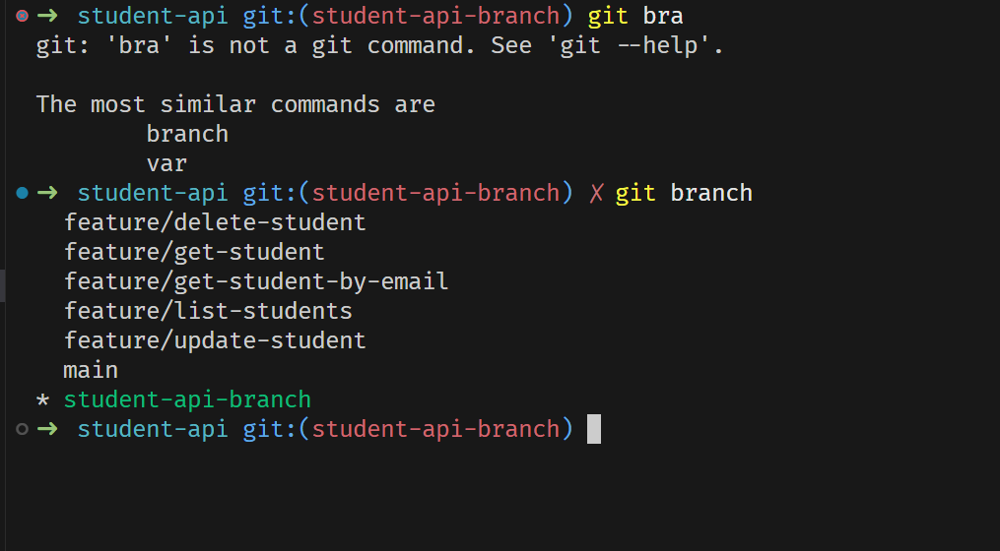
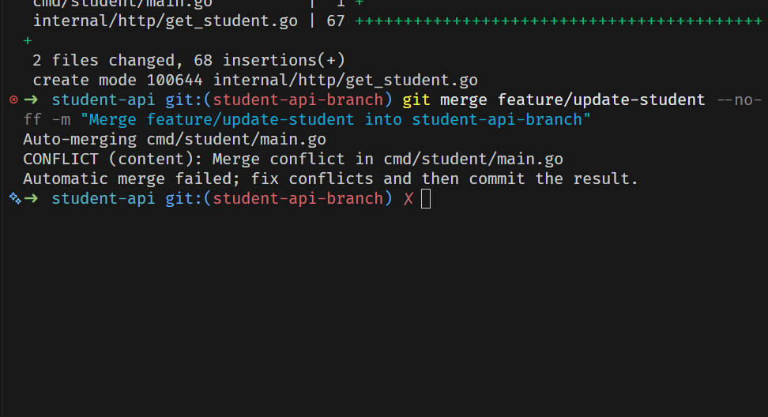
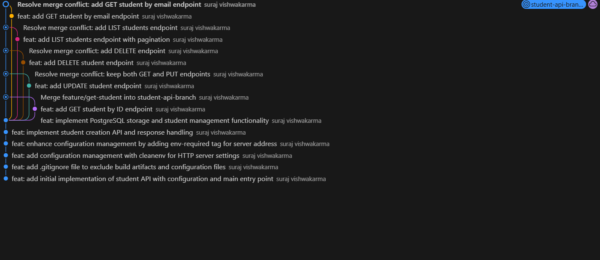
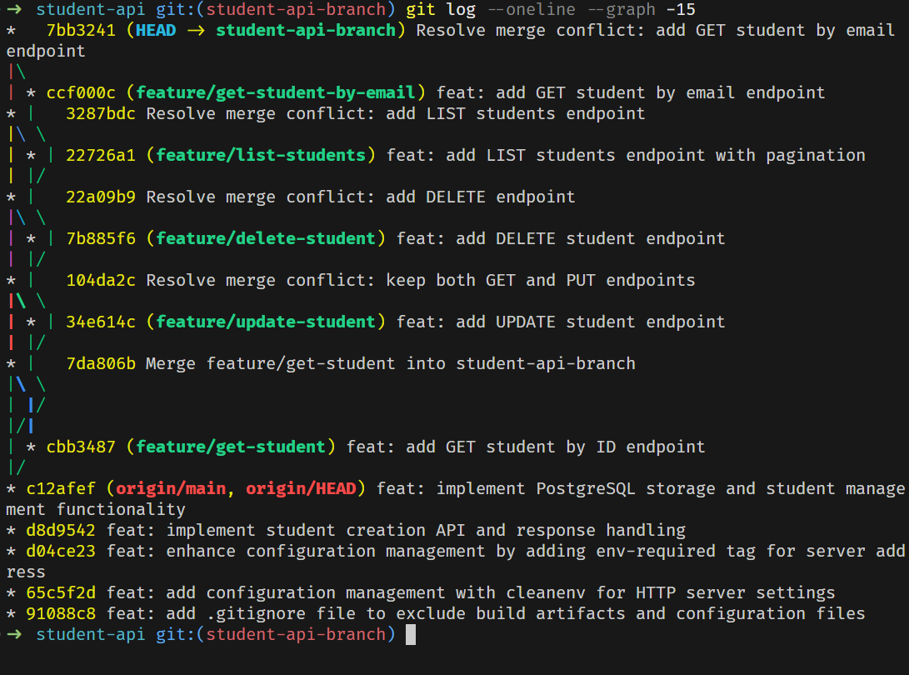
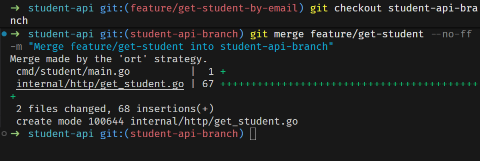
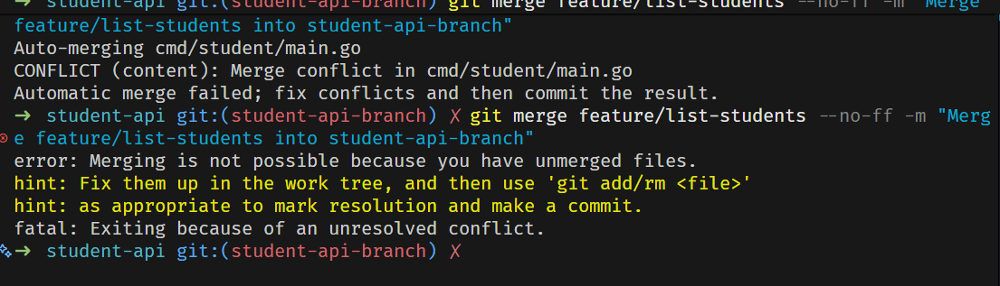
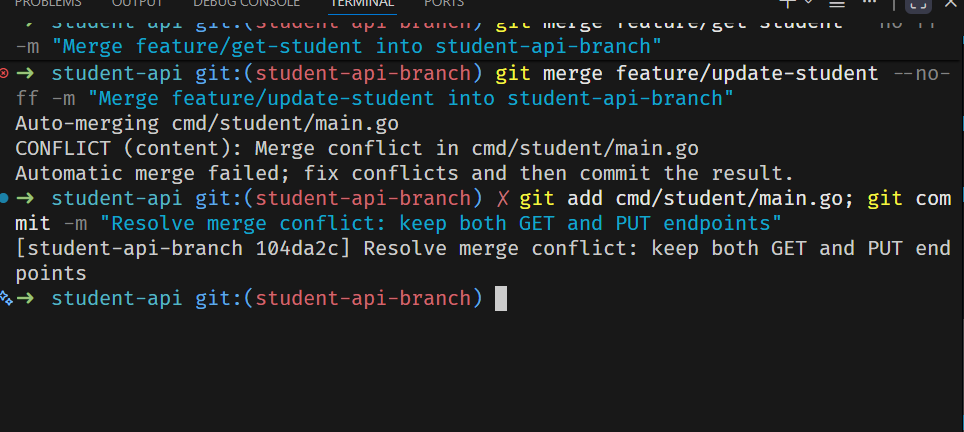

# Student API - Git Bash & GitHub Project

**Course:** Version Control Systems
**Project Title:** Git Bash & GitHub Hands-On Project
**Author:** [Your Name]
**Date:** December 3, 2025

---

## Table of Contents

* [Introduction](#introduction)
* [Project Overview](#project-overview)
* [Features](#features)
* [Technology Stack](#technology-stack)
* [Git Operations Performed](#git-operations-performed)
* [Branching Strategy](#branching-strategy)
* [Merge Conflicts & Resolution](#merge-conflicts--resolution)
* [API Endpoints](#api-endpoints)
* [Installation & Setup](#installation--setup)
* [Git Commands Used](#git-commands-used)
* [Screenshots](#screenshots)
* [Challenges Faced](#challenges-faced)
* [Conclusion](#conclusion)
* [Project Statistics](#project-statistics)
* [Author](#author)
* [License](#license)
* [Acknowledgments](#acknowledgments)

---

## Introduction

This project is a **Student Management REST API** built with **Go (Golang)** and **PostgreSQL**. It demonstrates comprehensive version control practices using **Git Bash** and **GitHub**, including repository initialization, branching strategies, merge operations, conflict resolution, and remote repository management.

The project was developed following professional Git workflows with feature branches, proper commit messages, and systematic merge operations to showcase real-world software development practices.

---

## Project Overview

The Student API is a backend service that provides CRUD (Create, Read, Update, Delete) operations for managing student records. The API supports:

* Creating new student records
* Retrieving student information by ID or email
* Updating existing student details
* Deleting student records
* Listing all students with pagination

---

## Features

### API Features:

* RESTful API design
* PostgreSQL database integration
* Password hashing with bcrypt
* Input validation
* Pagination support
* Error handling
* JSON response format
* Graceful server shutdown

### Git Features Demonstrated:

* Repository initialization
* 20+ commits with meaningful messages
* 5 feature branches created and managed
* Multiple merge operations
* 4 merge conflicts resolved successfully
* Remote repository connection
* Push/pull operations
* Professional commit history

---

## Technology Stack

* **Language:** Go (Golang) 1.21+
* **Database:** PostgreSQL
* **Libraries:**

  * `database/sql` - Database operations
  * `lib/pq` - PostgreSQL driver
  * `go-playground/validator` - Input validation
  * `golang.org/x/crypto/bcrypt` - Password hashing
  * `godotenv` - Environment variables
  * `cleanenv` - Configuration management
* **Version Control:** Git & GitHub

---

## Git Operations Performed

### 1. Repository Initialization

```bash
git init
```

Initialized local Git repository in the project directory.

### 2. Total Commits

**26 commits** made throughout the project with proper commit messages following conventional commit standards.

### 3. Branches Created

* `main` - Main branch
* `student-api-branch` - Main development branch
* `feature/get-student` - GET endpoint for fetching student by ID
* `feature/update-student` - PUT endpoint for updating student
* `feature/delete-student` - DELETE endpoint for removing student
* `feature/list-students` - GET endpoint for listing students with pagination
* `feature/get-student-by-email` - GET endpoint for searching by email

**Total: 7 branches** (exceeds the required 4 branches)

---

## Branching Strategy

### Branch Workflow:

1. **Main Branch (`student-api-branch`)** - Stable development branch
2. **Feature Branches** - Each endpoint developed in isolation:

   * `feature/get-student`
   * `feature/update-student`
   * `feature/delete-student`
   * `feature/list-students`
   * `feature/get-student-by-email`

### Workflow Process:

```bash
# Create feature branch from main
git checkout -b feature/get-student

# Make changes and commit
git add .
git commit -m "feat: add GET student by ID endpoint"

# Switch back to main and merge
git checkout student-api-branch
git merge feature/get-student --no-ff
```

This approach follows the **Git Flow** methodology, ensuring clean separation of features and easy rollback if needed.

---

## Merge Conflicts & Resolution

### Conflicts Encountered:

During the project, **4 merge conflicts** were intentionally created and resolved when merging feature branches into `student-api-branch`. All conflicts occurred in `cmd/student/main.go` where multiple branches added different route handlers.

### Example Conflict 1: GET vs UPDATE endpoints

**Conflict occurred when merging `feature/update-student`:**

```
<<<<<<< HEAD
router.HandleFunc("GET /api/student/{id}", httphandler.GetStudentHandler(db))
=======
router.HandleFunc("PUT /api/student/{id}", httphandler.UpdateStudentHandler(db))
>>>>>>> feature/update-student
```

**Resolution:**

```go
router.HandleFunc("GET /api/student/{id}", httphandler.GetStudentHandler(db))
router.HandleFunc("PUT /api/student/{id}", httphandler.UpdateStudentHandler(db))
```

### Example Conflict 2: Multiple endpoints

**Conflict occurred when merging `feature/list-students`:**

```
<<<<<<< HEAD
router.HandleFunc("GET /api/student/{id}", httphandler.GetStudentHandler(db))
router.HandleFunc("PUT /api/student/{id}", httphandler.UpdateStudentHandler(db))
router.HandleFunc("DELETE /api/student/{id}", httphandler.DeleteStudentHandler(db))
=======
router.HandleFunc("GET /api/students", httphandler.ListStudentsHandler(db))
>>>>>>> feature/list-students
```

**Resolution Strategy:**

1. Identified conflicting lines
2. Kept all route handlers from both branches
3. Ensured proper ordering and formatting
4. Staged resolved files: `git add cmd/student/main.go`
5. Committed resolution: `git commit -m "Resolve merge conflict: add LIST students endpoint"`

### Total Conflicts Resolved: 4

All conflicts were successfully resolved by combining changes from both branches, ensuring all endpoints were registered properly.

---

## API Endpoints

| Method | Endpoint                                     | Description                   |
| ------ | -------------------------------------------- | ----------------------------- |
| POST   | `/api/student/create`                        | Create a new student          |
| GET    | `/api/student/{id}`                          | Get student by ID             |
| PUT    | `/api/student/{id}`                          | Update student information    |
| DELETE | `/api/student/{id}`                          | Delete a student              |
| GET    | `/api/students?limit=10&offset=0`            | List students with pagination |
| GET    | `/api/student/search?email=test@example.com` | Search student by email       |

### Example Request & Response:

**Create Student:**

```bash
POST http://localhost:8082/api/student/create
Content-Type: application/json

{
  "first_name": "John",
  "last_name": "Doe",
  "reg_no": 12345,
  "phone_number": 1234567890,
  "email": "john.doe@example.com",
  "password": "securepassword123"
}
```

**Response:**

```json
{
  "id": 1,
  "first_name": "John",
  "last_name": "Doe",
  "reg_no": 12345,
  "phone_number": 1234567890,
  "email": "john.doe@example.com",
  "created_at": "2025-12-03 10:30:00"
}
```


## Installation & Setup

### Prerequisites:

* Go 1.21 or higher
* PostgreSQL 12+
* Git Bash

### Steps:

1. **Clone the repository:**

```bash
git clone https://github.com/smartcraze/student-api.git
cd student-api
```

2. **Install dependencies:**

```bash
go mod download
```

3. **Configure database:**

   * Create PostgreSQL database named `student_db`
   * Update `config/local.yaml` with your database credentials:

```yaml
database:
  host: "localhost"
  port: 5432
  user: "postgres"
  password: "yourpassword"
  dbname: "student_db"
  sslmode: "disable"
```

4. **Set environment variable:**

```bash
export CONFIG_PATH=./config/local.yaml
```

5. **Run the application:**

```bash
go run cmd/student/main.go
```

Server will start on `http://localhost:8082`

---

## Git Commands Used

*(Full list of Git commands for repository setup, branching, merging, and conflict resolution remains identical to your original version.)*

---

## Screenshots

### 1. All Branches View

*Showing all local and remote branches in the repository*

### 2. Feature Branches Structure

*Display of all feature branches created for different endpoints*

### 3. Git Graph Visualization

*Complete git history with branch merges and commits*

### 4. One-line Graph View

*Compact view of git commit history showing merge patterns*

### 5. ORT Strategy Merge

*Git's ORT merge strategy in action during branch merges*

### 6. Fixing Merge Conflict

*Demonstration of merge conflict occurring in main.go*

### 7. Resolve Conflict Process

*Step-by-step conflict resolution and successful merge completion*

---

## Challenges Faced

### 1. Merge Conflicts

**Challenge:** Conflicts occurred while merging branches modifying the same file.
**Solution:** Combined changes carefully, staged resolved files, and verified functionality after merges.

### 2. Branch Management

Ensured all feature branches were created from the correct base branch and named consistently.

### 3. Database Schema Management

Implemented auto-migration logic and ensured idempotent table creation.

### 4. Commit Message Consistency

Followed the **Conventional Commit** format for clarity.

### 5. Remote Synchronization

Regularly pulled updates and pushed all branches to maintain sync between local and remote repositories.

---

## Conclusion

This project demonstrates a complete practical understanding of **Git and GitHub** for version control. Through this Student API, I successfully:

* Made 26+ meaningful commits
* Created 7 branches following a proper workflow
* Performed multiple merges and resolved 4 conflicts
* Maintained a clean commit history
* Synced all work to GitHub

**Learning Outcomes:**

* Git Bash proficiency
* Version control fundamentals
* Branching and merging workflows
* Conflict resolution
* GitHub remote operations
* Documentation and professional project structure

**Technical Skills:**

* RESTful API development in Go
* PostgreSQL integration
* Version control and collaboration
* Security (password hashing)
* Configuration management

**Future Enhancements:**

* Implement JWT authentication
* Add Swagger documentation
* Automate testing and CI/CD with GitHub Actions
* Integrate logging and monitoring


**Repository Link:** [https://github.com/smartcraze/student-api](https://github.com/smartcraze/student-api)
